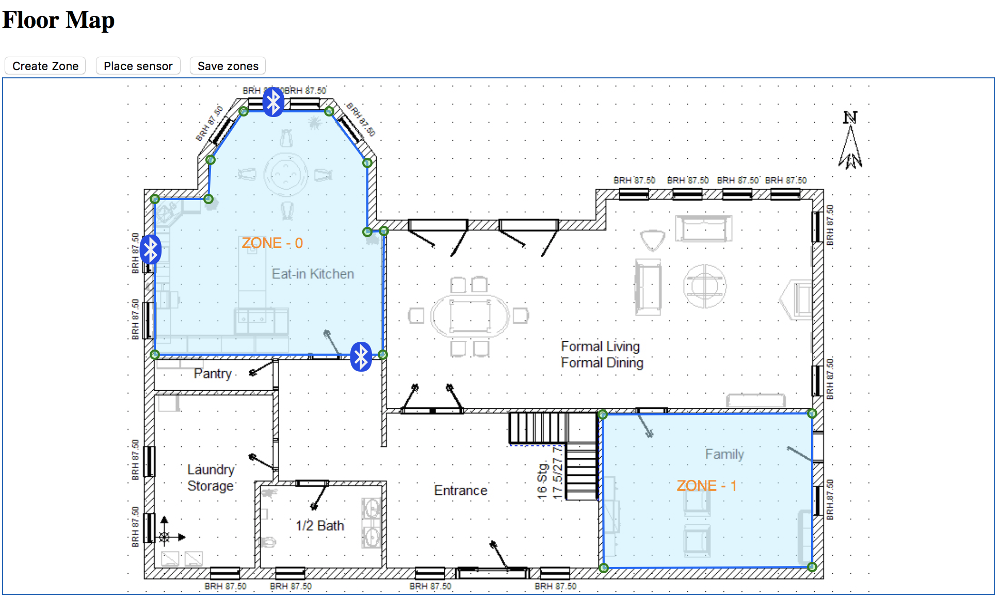

# Floor Plan V4(Work in progress)

A map-like interactive set of [reusable charts](http://bost.ocks.org/mike/chart/) 
for layering visualizations on a common local coordinate system like floor plans.

Here's an image of an example in action:



Requires [D3 V4+](V4.13.0).

## How to compile

[NodeJS +0.10](http://nodejs.org) is Required

Install [GruntJS](http://gruntjs.com/getting-started)
```bash
npm install -g grunt-cli
```

#### Install dependecies

```bash
npm install
```

To generate css, js and min versions into `dist` directory simply run  

```bash
grunt
```

## Example

```
    open the `example\index.html` in your favourite browser.
```

